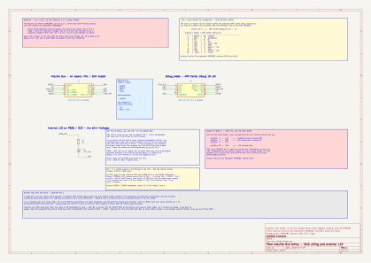

# arduino-due/blinky

A bare-metal Zig blinky for the [Arduino Due](https://docs.arduino.cc/hardware/due/)
(Atmel SAM3X8E, Cortex-M3). Toggles an **externally wired LED** on `PB26` / digital pin 22 at 1 Hz.

The firmware is trivial on purpose. The point is the toolchain: building and flashing go entirely
through Dagger modules, with no host-installed Zig and no host-installed flashing tool.



Editable KiCad source is in [`hardware/`](hardware/). Regenerate the SVG with:

```sh
flatpak run --command=kicad-cli org.kicad.KiCad sch export svg \
  --output arduino-due/blinky/hardware arduino-due/blinky/hardware/due-blinky.kicad_sch
```

(Drop the `flatpak run --command=kicad-cli org.kicad.KiCad` prefix if KiCad is installed natively.)

## Why not the on-board LED

The obvious choice is D13's on-board LED, and it is the wrong one.

An on-board LED blinking is weak evidence that this firmware is doing anything. Bootloader activity
or a **watchdog reset loop** makes the board blink by itself — and that is not hypothetical here.
The SAM3X8E watchdog is enabled out of reset with a ~16 s timeout; if it is not disabled the board
resets every few seconds, which on D13 looks *exactly* like a working blink. The headline test would
pass in precisely the case it is supposed to catch.

`PB26` / `D22` has no on-board LED, no boot-time role, and no peripheral alternate function in
[Arduino's variant table](https://github.com/arduino/ArduinoCore-sam/blob/master/variants/arduino_due_x/variant.cpp).
A steady 1 Hz there can only be this code.

## Hardware

**Required**

| Item | Notes |
|---|---|
| Arduino Due | Any revision |
| USB cable | Into the **Programming** port (the one nearer the DC jack) |
| LED | Any colour; red assumed for the resistor sizing below |
| 1 kΩ resistor | See the warning below before substituting |
| Breadboard + 2 jumpers | |

**Wiring** — on the `D22`–`D53` header, even-numbered (LHS) row:

```
  position  1  =  +5V     <-- DANGER: directly beside D22
  position  2  =  D22     ----> 1k resistor ----> LED anode
  position  3  =  D24
     ...
  position 18  =  GND     <---- LED cathode
```

> **D22 is the second pin in that row and the pin next to it is +5V.** Miscounting by one position
> feeds 5 V into a board whose I/O pins tolerate 3.3 V. Count twice and confirm GND with a
> continuity check before applying power.

> **Do not substitute 220 Ω.** `PB26` is in the SAM3X datasheet's **Group 2** (`PB[25–31]`), whose
> source limit is `IOH = −3 mA` at `VOH = VDDIO − 0.4 V` — not the −15 mA that Group 1 pins allow.
> At 220 Ω the LED would draw roughly 4 mA, outside spec. 470 Ω (~2 mA) is the practical floor.
> (Datasheet table 45-2, notes 2 and 3.)

**Optional — a debug probe.** Not needed to flash. Needed for breakpoints, memory inspection and
GDB, none of which SAM-BA can do. Any 3.3 V probe-rs-supported SWD probe works: CMSIS-DAP,
J-Link, ST-Link. **3.3 V only — a 5 V probe will damage the board.** The schematic documents the
header wiring, including the trap that Arduino numbers that connector from the opposite end to the
ARM Cortex Debug standard (`Arduino pin N == Cortex pin (11 − N)`).

## Build

No host Zig toolchain. The version is pinned by `minimum_zig_version` in `build.zig.zon`, which the
module reads.

```sh
DEVEX=github.com/z5labs/devex/daggerverse
SHA=bc5cee36080549722c6d3bf02152aa7d46d2dcf3

# Format check (check-only; never rewrites)
dagger -m $DEVEX/zig@$SHA call fmt --source=./arduino-due/blinky

# Build, and export the ELF
dagger -m $DEVEX/zig@$SHA call build --source=./arduino-due/blinky \
  file --path=bin/blinky.elf export --path=./blinky.elf

# Raw image, which is what bossac wants
dagger -m $DEVEX/zig@$SHA call obj-copy \
  --input=./blinky.elf --format=binary export --path=./blinky.bin

# Footprint
dagger -m $DEVEX/zig@$SHA call size --input=./blinky.elf flash
```

The image is ~244 bytes with empty `.data` and `.bss`.

> **Never pass `--target`.** The target is fixed hardware and is hardcoded in `build.zig`, which
> therefore does not call `standardTargetOptions`. The module would turn `--target` into
> `-Dtarget=`, and `zig build` rejects it as an unknown option. `--optimize` *is* supported and
> defaults to `ReleaseSmall`; a `Debug` build overflows the 256 KB flash region by ~35 KB once Zig
> links in its panic and formatting machinery.

## Flash

Two routes. Neither locks out the other: SAM-BA is burned into the SAM3X's ROM at the factory and
uses no flash space, so it can never be erased.

### Without a probe — bossac over the Programming port

Uses this repo's [`daggerverse/bossac`](../../daggerverse/bossac) module. bossac runs in a
container, never on your machine.

> **bossac does not require USB/IP.** If you have used bossac before, you ran it against
> `/dev/ttyACM0` directly and needed none of this. USB/IP is the cost of running it *in a
> container*: Dagger has no device passthrough, and a serial port is not a unix socket, so there is
> no lighter way to hand the board to a containerized process. If that trade is not worth it to you,
> `bossac --port=ttyACM0 --usb-port=0 --arduino-erase --erase --write --verify --boot=1 --reset
> blinky.bin` on the host does the same job — the build above stays hermetic either way.

So **host-side setup is required**: `usbip-utils`, the `usbip-host` and `vhci-hcd` kernel modules,
and a privileged Dagger engine. It is a one-time cost, and it is the same plumbing the probe path
needs later, so it is not throwaway work.

(Worth noting the asymmetry with probe-rs: that tool speaks *raw USB*, so USB/IP is genuinely its
only in-container option. SAM-BA is a byte stream, so bossac is not fundamentally stuck the same
way — what rules out a lighter socket bridge is that the 1200-baud touch does not survive one,
leaving you pressing ERASE and RESET by hand before every flash.)

```sh
# 1. On the machine holding the board, as root:
sudo dnf install -y usbip                     # or apt install usbip
sudo modprobe usbip-host vhci-hcd
sudo usbip list -l                            # find the busid for 2341:003d
sudo usbipd -D
sudo usbip bind --busid 3-1                   # substitute your busid

# 2. Confirm the board is reachable (writes nothing):
dagger -m ./daggerverse/bossac call sam-ba \
  --firmware=./blinky.bin --usbip=10.88.0.1:3240 --busid=3-1 \
  info output

# 3. Flash:
dagger -m ./daggerverse/bossac call sam-ba \
  --firmware=./blinky.bin --usbip=10.88.0.1:3240 --busid=3-1 \
  run exit-code
```

- `--usbip` must be an address the **engine** can route to. `127.0.0.1` inside the container is the
  container. On Linux use the container bridge gateway — `10.88.0.1` for podman, `172.17.0.1` for
  Docker; check with `docker network inspect bridge`.
- `usbip bind` takes the device away from the host: `/dev/ttyACM0` disappears locally while it is
  exported. `sudo usbip unbind --busid <id>` gives it back.
- **Check `exit-code`, not just whether `dagger` succeeded.** A bossac failure is reported as a
  non-zero exit code with no CLI error. A timeout is `124`.
- The module passes `--arduino-erase`, which is bossac's own 1200-baud touch: it makes the
  ATmega16U2 pulse ERASE and RESET, dropping the chip into SAM-BA.

### With a probe — probe-rs over SWD

Per the story's original toolchain, using
[`z5labs/devex//daggerverse/flash`](https://github.com/z5labs/devex/tree/main/daggerverse/flash).
**Untested here — no probe on hand.**

```sh
dagger -m $DEVEX/flash@$SHA call bridge-command --busid 3-1

dagger -m $DEVEX/flash@$SHA call probe-rs --firmware=./blinky.elf --chip=ATSAM3X8E \
  --usbip=10.88.0.1:3240 --busid=3-1 plan

dagger -m $DEVEX/flash@$SHA call probe-rs --firmware=./blinky.elf --chip=ATSAM3X8E \
  --usbip=10.88.0.1:3240 --busid=3-1 run exit-code

# verify chains off probe-rs, not off run -- one command cannot do both
dagger -m $DEVEX/flash@$SHA call probe-rs --firmware=./blinky.elf --chip=ATSAM3X8E \
  --usbip=10.88.0.1:3240 --busid=3-1 verify output
```

`ATSAM3X8E` is in probe-rs's registry, confirmed via `chip-info`. Note its memory map is narrower
than Arduino's linker script assumes — see `link.ld`.

## How it works

| File | Role |
|---|---|
| `link.ld` | SAM3X8E memory map; puts `.isr_vector` first in flash bank 0 |
| `src/start.zig` | Vector table, reset handler, `.data`/`.bss` init, `VTOR` |
| `src/main.zig` | Watchdog disable, PIOB setup, SysTick, blink loop |
| `build.zig` | Hardcoded `thumb-freestanding-eabi` / `cortex_m3` |

Order matters in `main()`:

1. **Disable the watchdog first.** `WDT_MR` is write-once and the watchdog is enabled out of reset.
2. **Clock PIOB** via `PMC_PCER0`. PIO register writes are silently dropped while the peripheral
   clock is gated — a wrong order here fails silently, not loudly.
3. Claim `PB26` and drive it out (`PIO_PER`, `PIO_OER`).
4. SysTick at `2_000_000` ticks per half period.

**On the clock:** no PLL is brought up, so `MCK` is still the 4 MHz reset-default RC oscillator.
(Arduino's `SystemInit()` climbs to 84 MHz; this deliberately does not.) 500 ms is then 2,000,000
ticks, which fits SysTick's 24-bit reload — at 84 MHz it would not, and would need a software
divider. Accuracy is the RC oscillator's few percent: fine for a blink, not a time reference.

## Verifying it worked

The LED should blink at 1 Hz — 500 ms on, 500 ms off — **and keep doing so after a power cycle**.
The power-cycle case is the one that matters: it proves the image is persistent and the watchdog is
genuinely disabled, rather than the board resetting in a loop.

If it does not blink at all, that is also informative — both the fault handler and the panic handler
halt rather than reset, so a fault stops the LED dead instead of producing a blink-like pattern.
