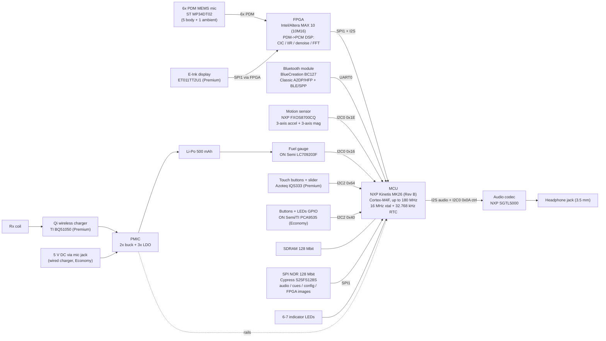

# Smart stethoscope — device identification & component recon

**Story:** [#9 `story(steth-research)`](https://github.com/Zaba505/embedded/issues/9) — identify the
device and inventory its components from public and owner-held sources **before** the teardown.

**Status of this document:** paper recon. Everything below is a **hypothesis to be confirmed against
the physical hardware in [#5](https://github.com/Zaba505/embedded/issues/5)**. No screw has been
turned, nothing has been desoldered, no rail has been probed, and no debugger has been attached to
produce this. Where a claim is strong it says so; where it is a guess it says that too.

> **This is reverse-engineering of a device the author owns, for repair and interoperability. It is
> not a certified medical device and nothing here is cleared for clinical use.** The original product
> was a market-cleared electronic stethoscope sold by its vendor; this project is not that product and
> makes no medical claim.

---

## 1. What the device is

> **Identity intentionally withheld.** The exact vendor and model **have been positively identified**
> by the owner, from the device's own engineering documentation. Those brand names — company, product,
> and variant marketing names — are **deliberately omitted from this public document** to avoid
> trademark and rights entanglements. Throughout, it is called simply **"the device"** or **"the
> stethoscope."** The private identification is recorded by the owner outside this repo. This does not
> weaken the recon — the component-level findings below stand on their own.

| | |
|---|---|
| **Class of device** | A discontinued **"smart" digital stethoscope** — records heart/lung/body sounds with a multi-microphone array + active noise cancellation, does on-device DSP, and streams/transfers recordings to a companion phone app for analysis (respiratory / pneumonia screening). |
| **Variants** | **"Premium"** — E-Ink display, wireless (Qi) charging, Bluetooth audio + file transfer. **"Economy"** — indicator LEDs only, wired 5 V charging via the audio jack, Bluetooth file transfer only. *(These are the descriptive tier names used in the design spec, not brand names.)* |
| **Companion app** | Vendor patient + provider apps (Android + iOS). The product/app line is **effectively end-of-life** (last app update 2023-03) — the motivation for this repair-and-interoperability work. |
| **Regulatory** | The original was a **market-cleared Class II electronic stethoscope** (21 CFR 870.1875). The specific clearance identifiers are omitted here for the same reason as the brand names. |
| **Settled directory name** | **`smart-stethoscope`** (this project; the repo's usual `<vendor>/<product>` scoping is deliberately collapsed to one unbranded name). |

The device is a sealed, hygienic-use puck: a chestpiece with a **6-microphone array**, capacitive or
tactile buttons on top, LEDs and/or a small E-Ink display, a Li-Po cell, and Bluetooth to a phone. It
records auscultation audio, does on-device DSP, stores recordings, and ships them to the companion app.

### How identity was established (and why it isn't printed here)

The strongest evidence is the device's **own engineering documentation, which the owner holds**: an
internal design specification (marked *Confidential*) containing a full system **block diagram** and
per-bus detail, plus a firmware release-notes changelog that names the product, the vendor, the
variants, and specific parts (BC127, SGTL5000, the GPIO extender, …). Those are corroborated by
matching manufacturer **datasheets** in the same owner-held archive, and by **public sources** (below).
That was more than enough to name the vendor and model outright — but per the owner's decision the
names are kept out of this file. This is a stronger starting point than #9 assumed was available, but
it does **not** remove the need for #5: the bench unit's hardware revision may differ from the spec
(the spec itself shows Rev A→Rev B churn; see [§9 Caveats](#9-caveats-and-known-inconsistencies)).

---

## 2. Sources and how confidence is rated

| Source | What it gave us |
|---|---|
| **Owner-held design spec** — internal "design specification" (block diagram + bus map + power table + register map) | The spine of the whole inventory: MCU, FPGA, codec, mics, radio, sensors, touch, display, power, buses, addresses |
| **Owner-held release notes** — firmware changelog (2021–2022) | Product/variant tier names, vendor identity, bootloader existence, BC127/SGTL5000/TI-GPIO confirmation, FreeRTOS, OTA update mechanism |
| **Owner-held datasheet archive** — manufacturer PDFs alongside the spec | Corroborates part families: NXP K22/K26 RMs, BC127, SGTL5000, Cypress S25FS SPI flash, ON Semi PCA9535, ST/NXP support docs |
| **Public web** — FCC filing (fccid.io), app stores / APK mirrors, regulatory DB, vendor marketing, patents | Independent confirmation of identity and the radio; see [§7](#7-fcc-filing) and [§8](#8-companion-app--public-sources) |
| **Datasheet-level inference** — bus/address present but part unnamed | Flagged explicitly as inferred |

**Confidence column values used in the inventory:**

- **A — vendor spec:** named outright in the manufacturer's own design documentation. Highest design
  intent, but still pending physical confirmation.
- **B — datasheet-corroborated:** named in the spec *and* backed by a matching manufacturer datasheet
  the owner holds.
- **C — public source:** independently visible in a public source (FCC / app / marketing / patent).
- **D — inferred:** not named anywhere; deduced from a bus, an I²C address, or the device's function.

> **Global caveat — applies to every row:** all of it is *paper*. Per #9, **every identification here
> requires physical confirmation in #5.** A datasheet in the archive proves the engineers *referenced*
> a part; it does not prove that exact part is on the bench unit's board.

---

## 3. System block diagram

Reproduced as Markdown from the block diagram in the owner-held design spec (the original document is
deliberately **not** committed — this repo keeps everything as browsable markdown). Bus names and I²C
addresses are as the spec labels them.

**The one architectural fact that matters most for downstream work:** this device has **no analog
microphone front end at all.** Six **PDM MEMS** microphones feed a **MAX 10 FPGA** that does the heavy
DSP in fabric (CIC decimation → dual-biquad IIR bandpass → 5-mic sum + separate ambient channel →
denoise → I²S). The MK26 CPU is a *slave* on that I²S link and passes audio to the SGTL5000 codec for
the headphone jack. That is a very different shape from the "electret → gain → filter → ADC" chain #6
anticipates — see [§10 proposed edits](#10-proposed-edits-to-5-6-and-7).

---

## 4. Component inventory

Columns: **Part** · **What it is** · **Function in the device** · **Board / bus (where the source
shows it)** · **Source** · **Confidence** (A/B/C/D per [§2](#2-sources-and-how-confidence-is-rated)).
Every row is **pending physical confirmation in #5.**

### 4.1 Compute & digital core

| Part | What it is | Function | Bus / address | Source | Conf. |
|---|---|---|---|---|---|
| **NXP Kinetis MK26 (Rev B)** — marking family `K26P169M180SF5` (e.g. `MK26FN2M0VMD18`, 169-MAPBGA) | ARM **Cortex-M4F** MCU, ≤180 MHz, on-chip flash + SRAM, SDRAM/FlexBus controller | **The main processor.** Runs FreeRTOS (the device's ARM firmware), orchestrates audio, BT, storage, UI, power | 16 MHz xtal + 32.768 kHz RTC osc | Spec (block dia., CPU §, clock §); RM in archive (`K26P169M180SF5RM`) | **A/B** |
| **Intel/Altera MAX 10 FPGA** ("Altera Max10 – 16 M device", i.e. **10M16**) | Low-cost flash-based FPGA w/ internal config flash | **All mic DSP:** 6-ch PDM→PCM, CIC (48:1) + IIR biquad bandpass + denoise + FFT/ARMA filter bank; drives display SPI; PLL → 64 MHz sysclk | SPI1 (CS0 display, CS2 FPGA regs), I²S, 60 MHz from CPU | Spec (block dia., register map, filter §) | **A** |
| **SDRAM, 128 Mbit** (Rev B) | Discrete SDRAM (part number not named) | Working RAM for the CPU/DSP pipeline | CPU SDRAM/FlexBus | Spec (block dia., power table) | **A** (part number **D/unidentified**) |
| **Cypress/Spansion S25FS128S** — SPI NOR, **128 Mbit** (expandable to 2 Gbit) | External serial NOR flash | **Bulk non-volatile storage:** audio recordings (~128 kbit/s, 8 kHz/16-bit mono), audio cues, **FPGA logic images** (backup + pending-burn), config (serial #, auth/**crypto keys**) | SPI1 (CS1) | Spec (flash §, bus table); S25FS128S datasheet in archive | **B** (exact PN B; density confirmed) |

### 4.2 Radio / connectivity

| Part | What it is | Function | Bus | Source | Conf. |
|---|---|---|---|---|---|
| **BlueCreation BC127** (Melody Audio module; CSR/Qualcomm-based) | Pre-certified **Bluetooth Classic + BLE** module w/ on-board antenna | **The only radio.** BLE/SPP + HFP for phone link; Classic **A2DP audio** on Premium; file transfer of recordings; reconfigured at each boot | **UART0** to CPU | Spec (block dia., power §); release notes ("configuration of the BC127 is set at each reboot"); BC127 datasheet in archive | **B** |

### 4.3 Acoustic / audio path

| Part | What it is | Function | Bus | Source | Conf. |
|---|---|---|---|---|---|
| **6× ST MP34DT02** (marking `MP34DT02TR`) | Omnidirectional **PDM MEMS** microphones | The transducer array: **5 body-facing + 1 ambient** (Mic5, side-facing, for noise cancellation). PDM streams straight to FPGA — **no analog stage** | 6× PDM → FPGA (clk ≤3.2 MHz) | Spec (block dia., mic §) | **A** |
| **NXP/Freescale SGTL5000** | Low-power stereo **audio codec** w/ headphone amp | Drives the **3.5 mm headphone jack** for live auscultation monitoring; I²S from CPU; its I²S L/R clock is the timing master the FPGA locks its mic clock to | I²S0 + **I²C0 0x0A** | Spec (block dia., clock §, power §); release notes ("SGTL5000 … DAP boost"); SGTL5000 datasheet in archive | **B** |

### 4.4 Sensors & human interface

| Part | What it is | Function | Bus / address | Source | Conf. |
|---|---|---|---|---|---|
| **NXP FXOS8700CQ** (marking `FXOS8700CQR1`) | 6-axis **accelerometer + magnetometer** (spec labels it "3-axis motion sensor") | Motion/orientation; release notes: the metadata file carries ~1000 acceleration vectors @100 Hz per recording | **I²C0 0x1E** | Spec (block dia., bus table) | **A** |
| **Azoteq IQS333** | Capacitive **touch controller** (buttons + wheel/slider, LED driver, proximity wake) | Premium UI: 3 touch buttons (TZ0–2) + right-edge slider (wheel 2); also drives the 6 UI LEDs; proximity wake via `LLWU_P8`/PTC4 | **I²C2 0x64** + INT | Spec (touch §, LED §); IQS333 datasheet in archive | **A/B** |
| **ON Semi / TI PCA9535** (`PCA9535` / TI `TCA9535`) | 16-bit **I²C GPIO expander** | Economy UI: reads 4 push buttons (SW1–4) and drives the LEDs; a later production batch switched to the **TI** equivalent | **I²C2 0x40** + INT (`LLWU_P8`/B8) | Spec (button §, LED §); release notes ("GPIO extenders … Texas Instruments"); PCA9535 datasheets in archive | **A/B** |
| **E-Ink `ET011TT2U1`** (~1.1″ EPD panel) | Small **E-Ink graphic display**, 25 mm | Premium-only UI: battery/storage/recording status | **SPI (via FPGA), CS0** | Spec (block dia., versions) | **A** (panel maker **D**) |
| **6–7 discrete LEDs** (D1–D7) | Indicator LEDs (R/G/B/orange/yellow/white) | Status: charging, BT, recording, classification (normal/abnormal), battery | via IQS333 (Premium) or PCA9535 (Economy); D4/D2 charge LED wired to charger | Spec (LED §) | **A** |

### 4.5 Power tree

| Part | What it is | Function | Source | Conf. |
|---|---|---|---|---|
| **Li-Po cell, 500 mAh, ~4.2 V** | Battery | Sole power source | Spec (power §) | **A** (cell PN **D**) |
| **TI BQ51050** | **Qi / inductive wireless power** Li-Ion charger-receiver | Premium-only wireless charging via Rx coil | Spec (block dia., power §) | **A** |
| **Wired charger** (5 V DC in via the **mic/audio jack**) | Li-Po charger for Economy | Economy charging; jack doubles as audio + power in | Spec (overview, power §) | **A** (PN **D/unidentified**) |
| **PMIC — "2 buck + 3 LDO in a single device"** | Multi-rail power-management IC | Generates the 1.8 V and 3.3 V/3.3 Va rails (seq: 1.8 V → 3.3 V → 3.3 Va → 2.5 V) | Spec (power §) | **A** (PN **D/unidentified**) |
| **ON Semi LC709203F** (`LC709203FQH-01TWG`) | I²C **battery fuel gauge** | State-of-charge; **must be initialized before other I²C0 traffic** (and only when not charging) | **I²C0 0x16** | Spec (battery-level §) | **A** |

### 4.6 Explicitly unidentified from paper sources

Listed rather than omitted — each is a known gap for #5:

- **SDRAM** — density known (128 Mbit), manufacturer/part number not named.
- **PMIC** — described functionally (2 buck + 3 LDO) but not named; **highest-value power unknown.**
- **Wired battery charger** (Economy 5 V path) — not named; may be integrated into the PMIC.
- **SPI NOR exact orderable PN** — family/density strong (S25FS128S), exact suffix unconfirmed.
- **E-Ink panel manufacturer** — part `ET011TT2U1` known, maker not pinned.
- **Li-Po cell** — capacity/chemistry known, no PN.
- **Board count & which board each part sits on** — the spec is logical, not physical; #5 establishes
  the physical board split.

---

## 5. MCU & Zig target feasibility (pre-answers #7's day-one blocking check)

The MCU is an **NXP Kinetis MK26**, an **ARM Cortex-M4F** (ARMv7E-M, Thumb-2, single-precision FPU
FPv4-SP-D16). Against #7's rule of thumb — *"Cortex-M yes, RISC-V yes, Xtensa/ESP32-classic no"* —
this lands **squarely in the "yes" bucket.** Zig/LLVM has a mature, in-tree ARM/Thumb backend and
ships `cortex_m4` as a first-class CPU model; no fork or out-of-tree toolchain is needed (unlike
ESP32-classic Xtensa, which is *why* it's the "no").

- **Hard-float (this part has an FPU):** `-target thumb-freestanding-eabihf -mcpu cortex_m4`.
  In `build.zig`: `.cpu_arch = .thumb, .os_tag = .freestanding, .abi = .eabihf,
  .cpu_model = .{ .explicit = &std.Target.arm.cpu.cortex_m4 }`. Zig's `cortex_m4` model **enables the
  FPU feature by default** (ziglang/zig#17374), so plain `cortex_m4` already gives FPv4-SP; runtime
  code must still enable CP10/CP11 in `CPACR`.
- **Soft-float variant** (if wanted): `-target thumb-freestanding-eabi -mcpu cortex_m4+soft_float`.
- **Prior art:** [MicroZig](https://github.com/ZigEmbeddedGroup/microzig) provides generic Cortex-M
  infrastructure and an NXP port — **but only LPC + MCX, no Kinetis/K-series** — so a custom
  MK26 target/HAL (SVD register defs, linker script, startup) must be authored. The canonical
  [STM32F4 (Cortex-M4F) Zig blink](https://rbino.com/posts/zig-stm32-blink/) and
  [`haydenridd/gcc-arm-to-zig`](https://github.com/haydenridd/gcc-arm-to-zig) are the closest
  templates.
- **Out of scope for Zig:** the **MAX 10 FPGA** is HDL/bitstream-configured, not a software CPU target
  — but because it holds the mic DSP, a full firmware re-implementation must account for the FPGA
  image separately (recoverable from external flash; see §6).

**Verdict:** Zig can target this MCU. #7 is not blocked on architecture support. *(Pending only the
physical confirmation that the bench unit's CPU really is a Cortex-M part — but the paper case is
strong.)*

---

## 6. Debug-port & firmware-dumpability hypotheses (unconfirmed — for #5/#7)

> **Both hypotheses below are UNCONFIRMED and must be proven physically in #5 (debug port) and #7
> (dump).** They are drawn from the owner-held spec, not from the bench unit.

### Debug port (feeds #5)

- **Protocol:** **SWD/JTAG** on the Kinetis MK26. The spec's "Processor JTAG Notes" describe recovering
  a bricked unit with a **Segger J-Link** and the `Unlock Kinetis` command, and reference `FSEC` at
  `0x0000_040C` — this is a standard Kinetis debug setup. A **"Debug" block** is drawn on the CPU in
  the block diagram.
- **Factory programming path exists** (so a physical port exists): the owner's archive contains a
  **PEmicro Cyclone** production image — the Cyclone programs Kinetis over SWD/JTAG. Firmware *was*
  flashed at the factory; the pads are there to be found.
- **Location/footprint:** **unknown — the single most valuable thing for #5 to nail down.** Expect a
  small row of SWD pads or a Tag-Connect footprint on the main (MCU) board near the MK26. Kinetis SWD
  is fixed-function (`SWD_CLK`/`SWD_DIO`/`RESET`), so #5 can prove pads by continuity to those named
  BGA balls (via nearest via/decap, since it's a BGA).
- **Logic level:** the digital core runs at **1.8 V** per the spec's rail table — **use a `VTref`
  probe; a 3.3 V probe on a 1.8 V part risks damage** (exactly #5's warning).

### Firmware dumpability (feeds #7)

- **The CPU application firmware lives in the MK26's internal flash**, not in the external SPI NOR.
  Whether it can be dumped hinges on **Kinetis flash security (`FSEC`/`FSEC[SEC]`, MDM-AP secured
  state)**:
  - If **secured**, SWD reads are blocked and the *only* recovery is a **mass-erase** ("Unlock
    Kinetis") — which **erases the firmware**. So "unlock the port" and "keep the original image" are
    **mutually exclusive** if security is on (precisely the trap #7 calls out). The spec's JTAG-recovery
    notes imply security *was* engaged at least during development.
  - If **not secured**, the image reads out directly over SWD. **Unknown until #5 measures it.**
- **Alternate routes if the MCU is locked** (all independent of MCU protection):
  - **External SPI NOR (S25FS128S)** is readable in-circuit with a SOIC-8 clip + `flashrom`. It holds
    the **FPGA bitstreams**, audio, cues, and config — so the **MAX 10 logic image is likely
    recoverable** even if the CPU is locked. Note config is described as holding **crypto keys**, so
    some contents may be encrypted.
  - **The vendor's companion app / OTA blobs.** Release notes describe an OTA update mechanism
    (downloaded binaries CRC-checked via `done.txt`/`lbdone.txt`, a **bootloader 2.0.x**, FPGA configs
    shipped as numbered images e.g. `133`/`135`). This strongly implies **the CPU firmware image and
    FPGA images ship inside the app / update packages** — a promising route to the original image
    without ever touching the debug port. The owner's archive already contains vendor app packages and
    a Cyclone production image.
  - **A vendor bootloader exists** (confirmed by the release notes). #7 must **flash to the application
    offset and not chip-erase**, or it destroys the only way back in.

---

## 7. FCC filing

**No standalone FCC filing exists under the vendor's or product's name — a confident negative,
recorded here as #9 requires rather than left blank.** A search of [fccid.io](https://fccid.io) under
the vendor name and product returns no grantee and no matching device (the only near-name hits are
unrelated companies). The official FCC OET EAS grantee search was attempted but timed out; since
fccid.io mirrors the OET database, the negative stands with high confidence. So there are **no
publicly available internal photographs or RF exhibit for the device itself** — #5 should not expect
fccid.io to hand over better teardown photos of this device the way it often does.

**Why: the radio rides on a pre-certified module.** A product built around a modular radio needs no
intentional-radiator filing of its own — it carries a *"Contains FCC ID: …"* label instead. The
BlueCreation **BC127** named in the spec is exactly such a part, and it has its own modular grant:

| Field | Value |
|---|---|
| FCC ID | **`SSSBC127-X`** |
| Grantee | **Cambridge Executive Limited** (BlueCreation / CSR–Qualcomm lineage) |
| Product | BC127-X Bluetooth 4.0 dual-mode module |
| Class | Part 15 DTS (spread-spectrum transmitter) |
| Band / modulation | **2402–2480 MHz, Bluetooth Classic + BLE** |
| Approval | Single Modular Approval, granted 2013-04-15; **module internal photos are public** |

This **independently corroborates the radio** (2.4 GHz BR/EDR + BLE) and is **consistent with there
being no device-specific filing**. Caveat: public FCC records do not themselves tie the BC127 to this
device — that link comes only from the owner-held spec. The module's photos
([fccid.io/SSSBC127-X](https://fccid.io/SSSBC127-X)) are the only FCC imagery available for anything in
this device.

---

## 8. Companion app & public sources

**The vendor's companion app — the OTA-firmware route #5/#7 want to mine:** the vendor shipped both a
**patient** and a **provider** app on **Android and iOS**. The **provider APK is still downloadable
from third-party APK mirrors** (last updated **2023-03-09**) — that stale date is the strongest public
signal the product line is dormant. *(The exact app name, package id, and store links are omitted here
along with the other brand identifiers; the owner has them recorded privately.)* That the APK is still
obtainable matters for #7: it — together with the **owner-held app packages and the Cyclone production
image** — is a concrete route to the original CPU firmware + FPGA images. From the owner-held release
notes, the app speaks **two Bluetooth protocols** (Protocol 1 = HFP + BLE/SPP live recording; Protocol
2 = recording over HFP) and performs **OTA firmware/FPGA updates with CRC-verified binaries**, with
app↔firmware compatibility tracked release-by-release.

**Public teardowns / service manuals: none found** — no iFixit, YouTube, or repair-forum teardown
surfaced. (Absence itself is information for #5: no external teardown to lean on.)

**Vendor / regulatory status (public):** the vendor is a still-operating company (recent trial and
patent activity), even though the product/app is dormant — so "discontinued" refers to the *product
line*, not the company. The original hardware was a **market-cleared Class II electronic stethoscope**
(the AI classifier was handled separately from the hardware clearance). *(Specific regulatory
identifiers, company name, location, and founders are omitted here by the same rule as the rest of the
identity.)*

**Patents — corroboration without citation.** The vendor's own published patents (numbers and
assignee deliberately **not** cited here, since they would name the company) independently corroborate
the device's *architecture*: an internal microphone array + a separate external noise-reference
microphone + onboard adaptive noise suppression + Bluetooth. Two things worth carrying into #5:

> **A genuine spec-vs-public conflict:** the vendor's foundational patent describes a research
> embodiment with **five _electret_ microphones**; the owner-held spec shows **six _PDM MEMS_
> (MP34DT02)**. The commercial device clearly diverged from the patent embodiment in both mic count
> and mic technology. The mic **array** is corroborated publicly; the **"six PDM MEMS"** specifics are
> **not**, and partially conflict — so #5 should physically confirm mic count and type, not assume
> either source.

> **What public sources could NOT corroborate at part level:** none of the specific part numbers —
> MK26, SGTL5000, MP34DT02, MAX 10, S25FS — appears in any public vendor source. They come **only**
> from the owner-held engineering docs. Only the **BC127** is independently real (its FCC module grant,
> §7). This is exactly why every row in §4 is marked "pending physical confirmation in #5."

---

## 9. Caveats and known inconsistencies

Recorded honestly, because each is a thing #5 must resolve against the metal:

- **Hardware-revision churn.** The spec is explicitly **"Rev B using NXP MK26 CPU."** The owner's
  datasheet archive *also* contains **Kinetis K22** material (`MK22F51212`, `K22P144M120SF5`, a
  120 MHz Cortex-M4). The clock section even describes a **120 MHz** core (a K22 speed) while the CPU
  section says **180 MHz** (a K26 speed). Read together this suggests **earlier revisions used an
  MK22 and Rev B moved to the MK26.** The bench unit could be *either* — #5 must read the actual
  package marking. (Both are Cortex-M4F, so the Zig verdict in §5 holds regardless.)
- **"HC-05" vs "BC127".** The power-budget table lists an **"HC-05 Bluetooth"** line, but the block
  diagram, the power narrative, *and the release notes* all say **BC127**. The HC-05 line is almost
  certainly a stale copy-paste from an early prototype. **Treat the radio as BC127.**
- **Flash density: "1 MB internal" vs K26's 2 MB.** The spec's CPU text says "1 MB Flash internal";
  the `K26FN2M0` part is 2 MB. Minor doc drift or a smaller variant — #5's marking settles it.
- **"3-axis" motion sensor.** The block diagram labels the FXOS8700CQ a "3-axis motion sensor"; the
  part is actually **6-axis** (3-axis accel + 3-axis mag). Doc imprecision, not a different part.
- **GPIO expander vendor.** Spec says **ON Semi PCA9535**; a release note says a later batch used the
  **TI** equivalent (TCA9535). Either is pin/'9535-register compatible — #5 reads the actual marking.
- **The spec is logical, not physical.** It shows buses and addresses, **not** which physical PCB each
  part sits on or the board count. That mapping is #5's job.

---

## 10. Proposed edits to #5, #6, and #7

This is the payoff of #9: the concrete specifics that replace each downstream story's "supplied at
implementation" blanks. **Applying these edits and doing the teardown itself is downstream — not part
of #9.** Each is written to be pasted more or less directly into the target issue.

### → Issue #5 (`steth-teardown`)

Replace the **"Inputs supplied at implementation"** section with these now-known values (all flagged
*paper — confirm against the unit*):

1. **Vendor / model / directory:** identified privately by the owner (brand names withheld from the
   repo by choice). Project directory **`smart-stethoscope`** (already created by #9).
2. **Key ICs to expect** (walk in confirming these, not discovering them):
   - MCU: **NXP Kinetis MK26** (Cortex-M4F, 169-MAPBGA; *watch for an MK22 on older revisions*).
   - DSP: **Intel/Altera MAX 10 (10M16) FPGA** — expect a second large device beside the MCU.
   - Radio: **BlueCreation BC127** Bluetooth module (UART to MCU).
   - Codec: **NXP SGTL5000** (by the headphone jack).
   - Mics: **6× ST MP34DT02 PDM MEMS** — **no analog front end to look for.**
   - External flash: **Cypress S25FS128S SPI NOR** (SOIC-8 near MCU) — *this is the alternate firmware
     route; find it.*
   - SDRAM (128 Mbit), IMU **FXOS8700CQ**, touch **IQS333**, GPIO **PCA9535/TCA9535**, fuel gauge
     **LC709203F**, wireless charger **TI BQ51050**, E-Ink **ET011TT2U1**.
   - **Unknowns to resolve on the bench:** the **PMIC** (2 buck + 3 LDO), the wired charger, the SDRAM
     PN, the Li-Po cell.
3. **Debug-port hypothesis (confirm):** **SWD/JTAG** on the MCU board; factory-programmed via **PEmicro
   Cyclone** and recoverable via **Segger J-Link `Unlock Kinetis`**. Prove pads by continuity to the
   MK26 SWD balls. **Digital core is 1.8 V — use a `VTref` probe.**
4. **Readout-protection gate (the #7 hand-off):** check Kinetis **`FSEC`/MDM-AP security**. If secured,
   unlock = mass-erase = firmware lost — so **read the external S25FS NOR first** (holds FPGA images +
   data), and treat the MCU image as recoverable primarily via the **app/OTA** route.
5. **Power tree to expect:** Li-Po → PMIC (2 buck + 3 LDO) → **1.8 V and 3.3 V/3.3 Va** rails
   (seq 1.8 → 3.3 → 3.3 Va → 2.5); charge via **BQ51050 (Qi, Premium)** or **5 V through the mic jack
   (Economy)**; fuel gauge **LC709203F** on I²C0 0x16 (init before other I²C0 traffic).
6. **Bus map to confirm** (from the spec): **I²C0** — IMU 0x1E, codec 0x0A, fuel gauge 0x16, FPGA TBD;
   **I²C2** — touch 0x64, GPIO 0x40; **SPI1** — display (CS0, via FPGA), flash (CS1), FPGA regs (CS2);
   **I²S0** — CPU↔codec↔FPGA; **UART0** — BC127.

### → Issue #6 (`steth-pcb`)

The reversed schematic is still the source of truth, but these facts reshape the design brief now:

1. **The transducer decision is essentially pre-made: PDM MEMS array, not an analog chain.** The
   original uses **6× PDM MEMS mics** (5 body + 1 ambient for noise cancellation) straight into an
   FPGA. #6's "Transducer front end / Gain / filter / ADC-or-codec" blocks collapse: with PDM MEMS
   **there is no analog gain/filter/ADC stage** (as #6's own note anticipates). The functional-
   equivalent decision is *keep the PDM-MEMS-into-a-DSP-fabric architecture* vs *deliberately diverge*
   to an analog+codec chain — and that divergence belongs in the delta table with a rationale.
2. **The DSP lives in an FPGA — a real architectural fork for the redesign.** A modern equivalent could
   (a) keep an FPGA/CPLD, (b) move the CIC/IIR/denoise DSP into a Cortex-M4F/M7 or an MCU with a
   hardware PDM/DFSDM peripheral, or (c) use a DSP-capable codec. Pick one deliberately; the original's
   choice (offload to MAX 10) is documented so the divergence is visible.
3. **Radio: the "prefer a pre-certified module" guidance is already validated** — the original *is* a
   pre-certified module (BC127). A current equivalent (e.g. a modern Qualcomm/Nordic BT
   Classic+BLE module) keeps the same no-RF-layout advantage; A2DP/HFP audio + BLE control is the
   required feature set.
4. **UI/power blocks have concrete originals to equal or simplify:** touch (IQS333) or buttons+GPIO
   (PCA9535); indicator LEDs and/or a small E-Ink panel; Li-Po + Qi (BQ51050) and/or wired charging;
   fuel gauge (LC709203F); a 1.8 V + 3.3 V PMIC.
5. **Enclosure constraints** are the sealed-puck chestpiece with a 6-mic array and top-face controls —
   capture the exact outline/mount/mic-port geometry from #5 before layout.

### → Issue #7 (`steth-firmware`)

1. **Zig architecture check — pre-answered: YES.** MCU is **Cortex-M4F**; use
   `-target thumb-freestanding-eabihf -mcpu cortex_m4` (see §5). #7 is **not** blocked on Zig support.
   *(Still confirm the physical part isn't an odd variant, but the "does Zig support it" gate is
   green.)*
2. **`probe-rs` support:** the Kinetis **MK26** family is in the probe-rs target registry
   (`MK26*`); run `probe-rs chip-info`/`chip list` early to confirm the exact variant, else commit a
   custom target YAML. Flash algorithm = standard Kinetis.
3. **A vendor bootloader EXISTS** (release notes: bootloader 2.0.x). **Flash to the application offset,
   preserve the bootloader, do not chip-erase.** This turns #7's "whether a vendor bootloader exists"
   from an unknown into a **known yes** with a hard constraint.
4. **Dump strategy (branches on #5's FSEC verdict):**
   - Try SWD read; if Kinetis security blocks it, **do not** mass-erase (that destroys the image).
   - Pull the **S25FS128S** in-circuit (`flashrom`, SOIC-8 clip) — recovers FPGA images + data.
   - Mine the **vendor's companion app / OTA packages** for the CPU firmware + FPGA images (CRC-checked
     binaries, `done.txt`) — the owner already holds app packages and a Cyclone production image.
5. **Debug wiring:** SWD, **1.8 V logic level** — call it out explicitly in the harness schematic; a
   3.3 V probe risks the part.
6. **Scope reminder that the DSP is in the FPGA:** a "blink" proof on the MCU is unaffected, but any
   real audio functionality later depends on the **MAX 10 bitstream**, which is a separate (non-Zig)
   artifact — worth a note in #7's "follow-up stories," alongside the existing BLE-stack scoping.

---

## 11. Acceptance-criteria trace (#9)

| #9 criterion | Where addressed |
|---|---|
| Exact vendor & model identified; directory recorded + created | **Identified privately by the owner; brand names intentionally withheld from this public doc (§1).** Dir `smart-stethoscope` created |
| FCC filing located (or "none found, why") | §7 |
| Vendor app/APK located & inspected (or why not) | §8, §6 (OTA route) |
| Public teardowns/reviews/manuals/patents searched & cited | §8 (patents corroborated but uncited by choice) |
| Component inventory as a table (what/function/board/source/confidence) | §4 |
| MCU, radio, transducer/mic, codec/ADC, power chain, external SPI flash each addressed | §4.1–4.5 |
| Unidentified parts listed explicitly | §4.6 |
| Whether Zig supports the MCU architecture stated | §5 |
| Debug-port hypothesis, flagged unconfirmed | §6 |
| Firmware-dumpability hypothesis, flagged unconfirmed | §6 |
| Committed, browser-viewable markdown, linked from a discoverable place | this file; linked from project README and repo README |
| Every ID sourced + confidence marker; all flagged as needing physical confirmation in #5 | §2 + §4 (global caveat) |
| Concrete proposed edits to #5/#6/#7 | §10 |
| States it's owner's device, for repair/interop, not a certified medical device | header + §1 |

> **Note on the first row:** #9 asks for the vendor and model to be *named*. They have been positively
> **identified** — the acceptance intent (know what the device is before teardown) is met — but the
> names are **deliberately not printed in the repo**, at the owner's direction, to avoid trademark and
> rights entanglements. The identification is retained privately by the owner.
